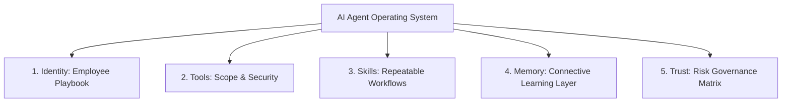

# AI Agent Operating System — The 5 Pillars

> **Architecture Blueprint:** Built upon the 5 core system components of effective AI agent engineering.

---

## 5-Pillar Index

| Pillar | File | Description | Focus Area |
| :--- | :--- | :--- | :--- |
| **1. Identity** | [`1_IDENTITY.md`](file:///Users/apple/Documents/Development/Websites/travelglb/info/Identity/1_IDENTITY.md) | The Employee Playbook | Persona, tech stack, partner profile, Emil Kowalski rules |
| **2. Tools** | [`2_TOOLS.md`](file:///Users/apple/Documents/Development/Websites/travelglb/info/Identity/2_TOOLS.md) | Scope & Permissions | Tool boundaries, secret isolation (`.env`), API security |
| **3. Skills** | [`3_SKILLS.md`](file:///Users/apple/Documents/Development/Websites/travelglb/info/Identity/3_SKILLS.md) | Repeatable Workflows | Workflows, quality gates, hard execution rules |
| **4. Memory** | [`4_MEMORY.md`](file:///Users/apple/Documents/Development/Websites/travelglb/info/Identity/4_MEMORY.md) | Connective Memory Layer | Learning protocol, "Remember" trigger, persistent memories |
| **5. Trust** | [`5_TRUST.md`](file:///Users/apple/Documents/Development/Websites/travelglb/info/Identity/5_TRUST.md) | Risk Governance Matrix | 4 Autonomy Levels: **Own, Consult, Augment, Automate** |

---

## Summary Diagram

