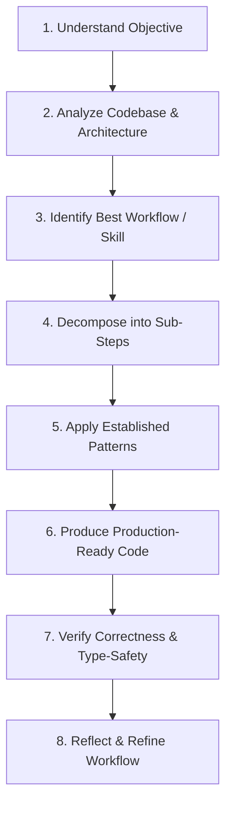

# Autonomous Skills & Workflow Architecture

> **Core Directive:** Continuously refine and apply execution workflows to build *Peaks & Paths — Himalayan Travel Atlas* with senior-level precision, craft, and architectural consistency.

---

## 1. The 8-Step Task Execution Lifecycle

For **every** task, feature request, or refactor, the agent follows this 8-step lifecycle:

1. **Understand the Objective:** Identify user intent, target experience, and boundaries.
2. **Analyze Existing Codebase:** Inspect relevant files, existing components, state hooks, and design tokens—never guess when the code holds the answer.
3. **Identify Best Workflow / Skill:** Select existing project skills (`emil-design-eng`, `mapbox-geospatial-operations`, `ui-ux-designer`, `frontend-design`) or synthesize a new workflow.
4. **Decompose Complex Work:** Break large requests into discrete, verified components.
5. **Follow Established Patterns:** Reuse components (`AnimatedWord`, `OptimizedImage`, `Cursor`, etc.), design tokens (`index.css`), and state structures (`himalaya.ts`, Zustand stores) unless there is a strong reason to improve them.
6. **Produce Production-Ready Output:** Write modular, typed, clean React 19 / TypeScript code.
7. **Verify Correctness:** Run `npx tsc --noEmit` and check for visual regression, responsiveness, and zero console errors before declaring completion.
8. **Reflect & Refine:** Save newly discovered workflows or patterns into the project's skill registry for future use.

---

## 2. Core Execution Principles

- **Never Guess:** Query files, search imports, and check types before writing new code.
- **Component Reuse First:** Always check `src/components/` before creating a new UI element.
- **Simplicity Over Cleverness:** Build readable, maintainable solutions over complex abstractions.
- **Triple-Perspective Mindset:** Act as **Senior Engineer** (code quality, type-safety), **Product Designer** (craft, micro-interactions, aesthetic perfection), and **Project Owner** (performance, security, long-term vision).
- **Zero Tech Debt Expansion:** Fix warnings, maintain clean CSS classes, and keep bundle size optimized.
- **Security & Performance First:** Enforce secret isolation (`.env`), lazy loading (`MapContainer`), and hardware-accelerated CSS animations.

---

## 3. Project Skill Registry

| Skill Name | Focus Area | Location / Reference | Primary Trigger / Use Cases |
| :--- | :--- | :--- | :--- |
| **`emil-design-eng`** | UI Polish & Motion | `.agents/skills/emil-design-eng` | Micro-interactions, spring physics, `:active` scales, easing curves |
| **`frontend-design`** | Aesthetic Direction | `.agents/skills/frontend-design` | Layout design, typography, dark mode palettes, visual hierarchy |
| **`mapbox-geospatial-operations`**| 3D Map & Camera | `.agents/skills/mapbox-geospatial-operations`| Mapbox GL JS, DEM terrain, flyTo animations, camera bounds |
| **`ui-ux-designer`** | Component Wireframing | `.agents/skills/ui-ux-designer` | Structural component design, drawer/modal specs, responsiveness |
| **`security-environment-guard`** | Security & Config | `info/Identity/IDENTITY.md` | Secrets isolation, `.env.example`, domain restrictions, git safety |

---

## 4. Continuous Improvement & Workflow Synthesis

When encountering a new problem domain (e.g. specialized map animation, offline caching, or custom SVG rendering):
1. Document the solution pattern cleanly.
2. Formalize the workflow inside `info/Identity/SKILLS.md` or as a reusable skill under `.agents/skills/`.
3. Apply the refined workflow automatically on subsequent similar tasks.
