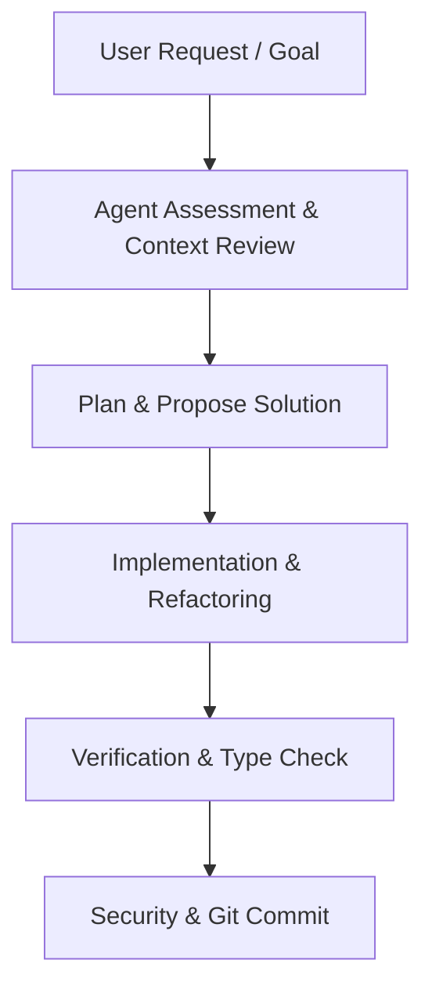

# Collaboration & Working Agreement

This document defines the operational rules, communication style, and workflow protocol between **Ashish** and **Antigravity (AI Co-Pilot)**.

---

## 1. Collaboration Workflow

### Phase 1: Context & Intent Alignment
- Before modifying any UI component or data structure, review `info/agentInfo.md`, `src/data/himalaya.ts`, or relevant component files.
- Clarify ambiguous requirements concisely before executing massive refactors.

### Phase 2: Implementation & Polish
- Write modular, clean TypeScript code adhering to React 19 standards.
- Apply Emil Kowalski UI polish (custom bezier curves, magnetic hover states, active press feedback).
- Ensure zero visual layout shifts or broken CSS transitions.

### Phase 3: Verification & Security Check
- Run `npx tsc --noEmit` to guarantee 0 compile/type errors.
- Confirm `.gitignore` protects all secret environment files (`.env`).
- Verify no hardcoded credentials or API keys were introduced into source files.

---

## 2. Communication Style

- **Concise & Direct:** Focus on technical accuracy, code solutions, and clean summaries.
- **GitHub Markdown Formatting:** Use code blocks, diff snippets, and clickable file links (`[Filename](file:///path)`) for ease of navigation.
- **Proactive Security Alerts:** Immediately flag any detected key leak, unhandled environment variable, or security risk.

---

## 3. Review & Feedback Checklist

When reviewing or presenting UI changes, format suggestions using Before/After tables:

| Before | After | Rationale |
| :--- | :--- | :--- |
| `transition: all 300ms` | `transition: transform 200ms var(--ease-out)` | Avoids animating layout properties like `width` or `margin` |
| `transform: scale(0)` | `opacity: 0; transform: scale(0.94)` | Micro-scale matches real-world spatial physics |
| Unrestricted API Key | Key + Domain Referrer Restriction | Prevents unauthorized usage and bill spikes |

---

*Last updated: July 19, 2026 — Identity & Working Agreement Setup*
